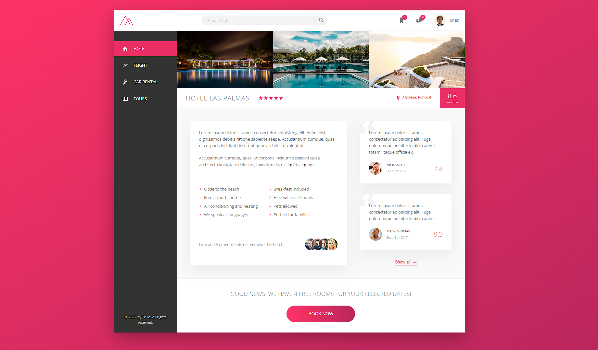
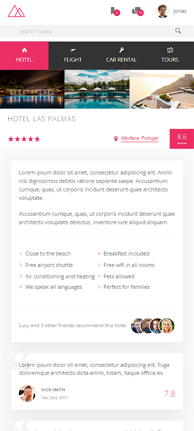

# Trillo

Trillo is working front-end website developed during [Advanced CSS and Sass: Flexbox, Grid, Animations and More!](https://www.udemy.com/course/advanced-css-and-sass/) course by Jonas Schmedtmann. 

It was designed by [Jonas Schmedtmann](https://www.udemy.com/user/jonasschmedtmann/).

## Screenshots

### Desktop

### Tablet

### Phone

## Built with

- HTML5
- Sass
- JavaScript
- Node