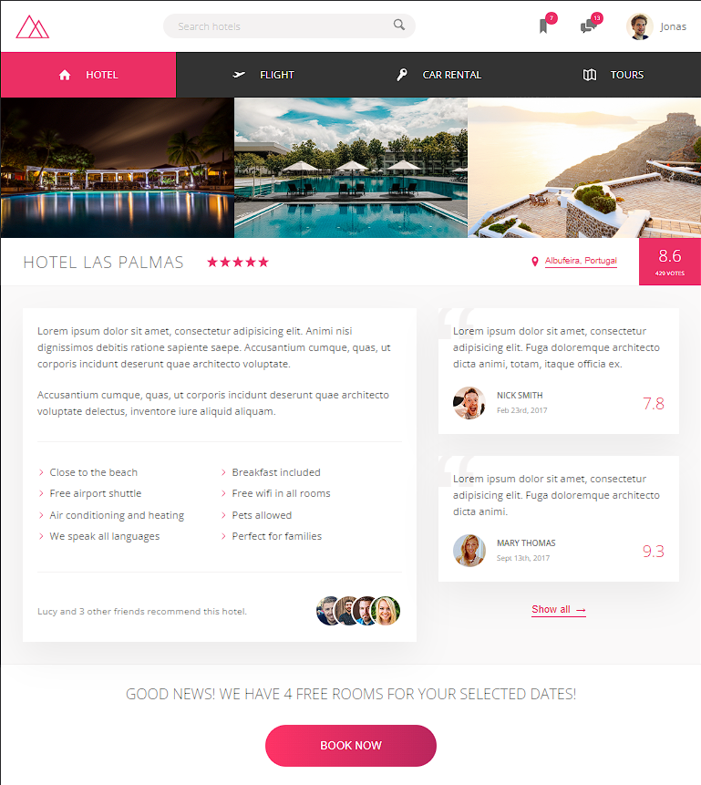

# Trillo

## About

Trillo is a landing page developed during [Advanced CSS and Sass: Flexbox, Grid, Animations and More!](https://www.udemy.com/course/advanced-css-and-sass/) course. 

Trillo is a website to make your traveling life easier. Using Trillo you can find your next hotel, book your flight, rent a car and even find tours that can take you to the best spots in town!

Designed by: [Jonas Schmedtmann](https://www.udemy.com/user/jonasschmedtmann/).

## Screenshots

### Desktop

### Tablet

### Phone

